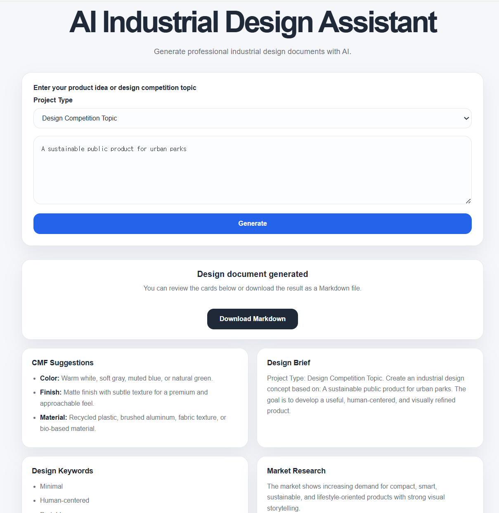

# AI Industrial Design Assistant

AI Industrial Design Assistant is an open-source web application that helps industrial designers, product design students, and design competition participants generate structured design project documents from a simple product idea or competition topic.

The project currently runs with placeholder data in Version 1. Future versions will connect to the OpenAI API to generate more advanced and customized design outputs.

## Purpose

Industrial design projects often require many connected documents, including research, personas, design briefs, CMF direction, concept development, rendering prompts, and presentation scripts.

This tool aims to support the early design process by helping users quickly generate a complete starting structure for their projects.
## Preview


## Features

Version 1 can generate placeholder content for:

- Design Brief
- Target User
- User Pain Points
- Persona
- Market Research
- SWOT Analysis
- Design Keywords
- CMF Suggestions
- Product Concept
- Rendering Prompt
- Presentation Script

Version 1 also includes:
- Project type selection for Product Idea and Design Competition Topic
- Responsive card-based interface
- Markdown export for generated design documents
- Placeholder generation system prepared for future OpenAI API integration

## Documentation
- [Codex Application Draft](docs/codex-application-draft.md)
- [Project Overview](docs/project-overview.md)
- [Design Workflow](docs/design-workflow.md)
- [OpenAI Integration Plan](docs/openai-integration-plan.md)
- [Sample Output](examples/sample-output.md)
## Tech Stack

- Python
- Flask
- HTML
- CSS
- JavaScript


## Project Structure

```text

ai-industrial-design-assistant/

├── [app.py](http://app.py)

├── requirements.txt

├── [README.md](http://README.md)

├── LICENSE

├── templates/

│   └── index.html

├── static/

│   ├── style.css

│   └── script.js

├── docs/

└── examples/

```

git clone [https://github.com/jihyeBaek0/ai-industrial-design-assistant.git](https://github.com/jihyeBaek0/ai-industrial-design-assistant.git)

cd ai-industrial-design-assistant
# AI Industrial Design Assistant

AI Industrial Design Assistant is an open-source web application that helps industrial designers, product design students, and design competition participants generate structured design project documents from a simple product idea or competition topic.

The project currently runs with placeholder data in Version 1. Future versions will connect to the OpenAI API to generate more advanced and customized design outputs.

## Purpose

Industrial design projects often require many connected documents, including research, personas, design briefs, CMF direction, concept development, rendering prompts, and presentation scripts.

This tool aims to support the early design process by helping users quickly generate a complete starting structure for their projects.

## Features

Version 1 can generate placeholder content for:

- Design Brief
- Target User
- User Pain Points
- Persona
- Market Research
- SWOT Analysis
- Design Keywords
- CMF Suggestions
- Product Concept
- Rendering Prompt
- Presentation Script

Version 1 also includes:

- Responsive card-based interface
- Markdown export for generated design documents
- Placeholder generation system prepared for future OpenAI API integration

## Tech Stack

- Python
- Flask
- HTML
- CSS
- JavaScript

## Project Structure

```text
ai-industrial-design-assistant/
├── app.py
├── design_generator.py
├── requirements.txt
├── README.md
├── LICENSE
├── CONTRIBUTING.md
├── templates/
│   └── index.html
├── static/
│   ├── style.css
│   └── script.js
├── docs/
│   └── project-overview.md
└── examples/
    └── sample-output.md
```

## Getting Started

### 1. Clone the repository

```bash
git clone https://github.com/jihyeBaek0/ai-industrial-design-assistant.git
cd ai-industrial-design-assistant
```

### 2. Create a virtual environment

```bash
python -m venv .venv
```

### 3. Activate the virtual environment

For Windows PowerShell:

```bash
.\.venv\Scripts\Activate.ps1
```

If PowerShell blocks script execution, run:

```bash
Set-ExecutionPolicy -ExecutionPolicy Bypass -Scope Process -Force
```

Then activate again:

```bash
.\.venv\Scripts\Activate.ps1
```

### 4. Install dependencies

```bash
python -m pip install -r requirements.txt
```

### 5. Run the Flask app

```bash
python app.py
```

Then open:

```text
http://127.0.0.1:5000/
```
## Running Tests

This project uses pytest for automated testing.

To run the test suite locally:

```bash
python -m pytest
## Current Version

### v0.5.0

Current status:
- Project type selection added
- Flask app setup completed
- Responsive web interface created
- Placeholder design document generator implemented
- Card-based result layout added
- Markdown export feature added
- Project documentation added
- Contribution guidelines added
- Issue and pull request templates added
- Pytest-based automated tests added
- GitHub Actions CI workflow added
- CI status badge added to README
- OpenAI API integration planned for a future version
- OpenAI integration plan added
## Roadmap

Planned improvements:

- Add OpenAI API integration
- Improve Markdown export formatting
- Add export to PDF
- Add example design projects
- Add prompt templates for industrial design workflows
- Add documentation for design students
- Add deployment guide
- Create v1.0 release with demo GIF

## Example Use Cases

Users can enter prompts such as:

```text
A modular desk organizer for industrial design students
```

```text
A portable air purifier for small apartments
```

```text
A sustainable public product for urban parks
```

The app will generate structured design project content that can be used as a starting point for research, concept development, and presentation preparation.

## License

This project is licensed under the MIT License.